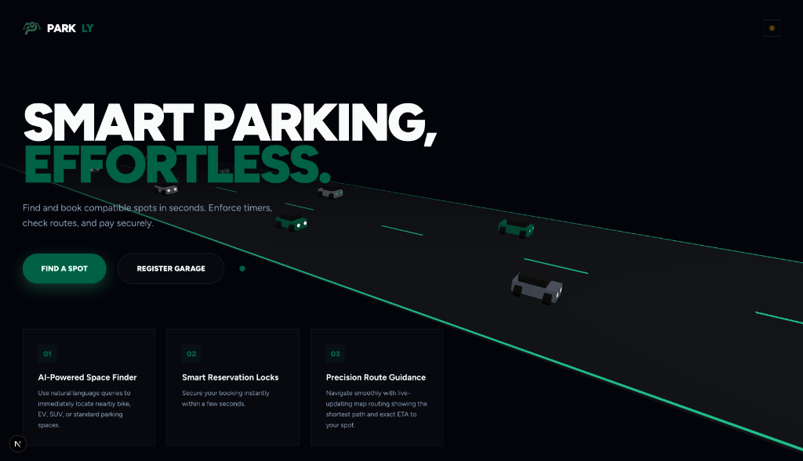
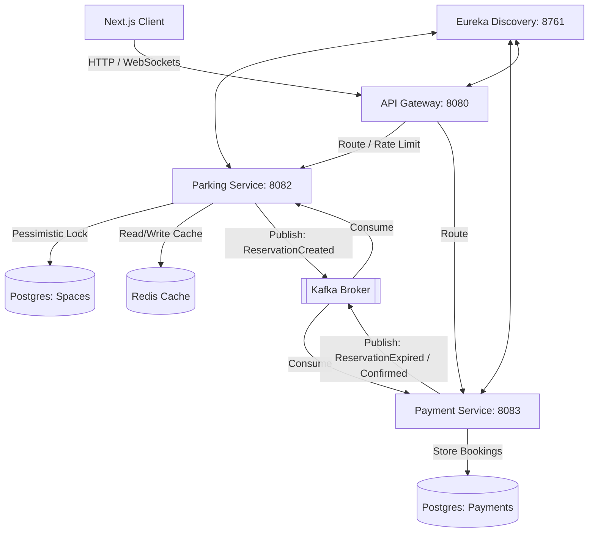

# Parkly — Smart Parking Management System

Parkly is an event-driven smart parking reservation platform. It combines a robust **Spring Boot microservices** backend orchestrating spot-locking and automated expiries with a responsive **Next.js frontend** featuring interactive Leaflet maps and 3D WebGL animations.

---

## Preview

<p align="center">
  
</p>

---

## System Architecture

Parkly uses a decoupled, event-driven microservices architecture communicating via **Apache Kafka** event streams:



---

## Key Features

* **3D Landing Page**: High-performance Three.js traffic animation with responsive light/dark mode shaders and GSAP animations.
* **Geospatial Map Search**: Interactive Leaflet maps rendering dynamic occupancy markers based on current spot availability.
* **Spot Selection Drawer**: Sliding panel displaying a visual layout grid of standard, EV-charging, and SUV parking spots.
* **Active Countdown Banner**: Ticking 15-minute countdown clock synchronizing database locks with client states.
* **Double-Booking Protection**: Pessimistic write locks (`@Lock(LockModeType.PESSIMISTIC_WRITE)`) on database records during reservation requests.
* **Automated Expirations**: Background scheduler sweeps bookings every 10 seconds, transitions expired locks, and broadcasts releases back to the parking spaces database via Kafka.

---

## Tech Stack

* **Frontend**: Next.js 15+ (App Router), Tailwind CSS, Three.js, GSAP, Leaflet, Redux Toolkit (RTK Query)
* **Backend**: Spring Boot 3.2.0, Spring Cloud (Gateway & Eureka Discovery), Apache Kafka, Redis, PostgreSQL, Maven

---

## Getting Started (Local Setup)

### **1. Start Infrastructure Containers**
```bash
docker compose up -d
```

### **2. Run Backend Services**
Start the discovery server, gateway, and microservices in order (run each command in a separate terminal):
```bash
# 1. Discovery Registry (Eureka)
cd backend/discovery-server && mvn spring-boot:run

# 2. API Gateway
cd backend/api-gateway && mvn spring-boot:run

# 3. Parking Space Service
cd backend/parking-service && mvn spring-boot:run

# 4. Payment & Booking Service
cd backend/payment-service && mvn spring-boot:run
```

### **3. Run the Frontend**
```bash
cd frontend
npm install
npm run dev
```

Open **[http://localhost:3000](http://localhost:3000)** in your browser to access the app.

---
